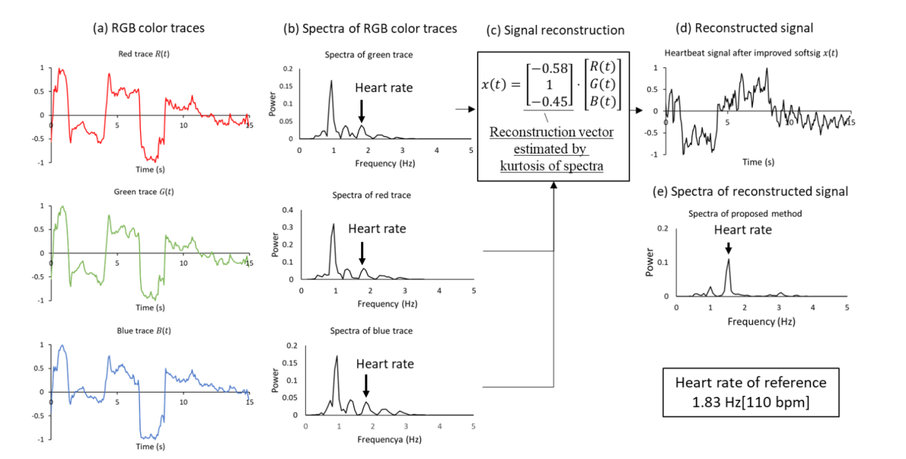
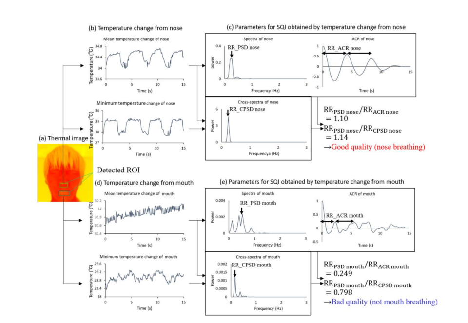

# Heart Rate detection using FLiR Infrared Imaging Sensor
This project involves using an FLiR sensor to measure the heart rate, breath rate and temperature of a person and report the results to an online web dashboard for viewing. These properties should be able to be measured for both stationary and in motion individuals, using machine learning to accurately track and measure the test subject.

# apollo-red
The short title of this project is Apollo-Red, being inspired by the Greek god of Medicine (Apollo) and colour of the heart (red).

# Team Member List and Roles
Project team members: Damien Raju, Pacifique Rukiza, Jesse Ruffini, Jarrod Bennett.

Team member role...
* Damien Raju : Software flowcharts. ML algorithms, real time GUI display
* Pacifique Rukiza : Hardware Architecture block diagram (Pin connections between argon and sensor), Full system block diagram
* Jesse Ruffini : Algorithm schemes, Data collection searching
* Jarrod Bennett : Wireless Network Comms, BT connection between argon and base, Messaging protocol

# Project Overview
## Project Description
The base project involves measuring the heart rate of a person using a FLiR infrared imaging sensor, using machine learning models to accurately measure the heart rate of both stationary and in motion test subjects and report measurements to a web dashboard.

## Key Performance Indicators
The success of the project will be measured by
1. Ability to communicate with FLiR sensor module
2. Ability to transfer data to <unit> for processing over network
3. Ability to accurately track and identify test subject
4. Ability to measure heart rate, breath rate and temperature of individual from sensor data
5. Ability to send test subject measurements to dashboard for online viewing

## System Overview
### System Block Diargam

### Hardware Architecture Block Diagram

### Equipment 
- Fir Sensor 
- Nordic Dongle
- Particle Argon

## Sensor integration
- The only sensor required for the project is the FLiR sensor onboard the FLIR Radiometric Lepton Dev Kit V2. 
- Unsure of the data required/what data exactly is transmitted
- Sensor integration? Does that apply to us with only one sensor?

## Wireless Network Communication
- Unsure of network setup
- Perhaps bluetooth connection from 'measurement node' with sensor to 'base station node' for uploading data to PC

## Algorithms used
- Machine learning algorithm to detect the face
- Algorithm to extract heart rate frequency

- Algorithm to extract breath rate 

# Equipment
The equipment used for the project includes
- Particle Argon microcontroller -> used to interface with the sensor module and transmit processed sensor data to base station/dashboard whatever we end up doing
- FLIR Radiometric Lepton Dev Kit V2 -> Sensor module used to capture thermal images used for processing
- Any other devices...

# Current Progress
- Working on milestone
- Waiting for sensor module...
